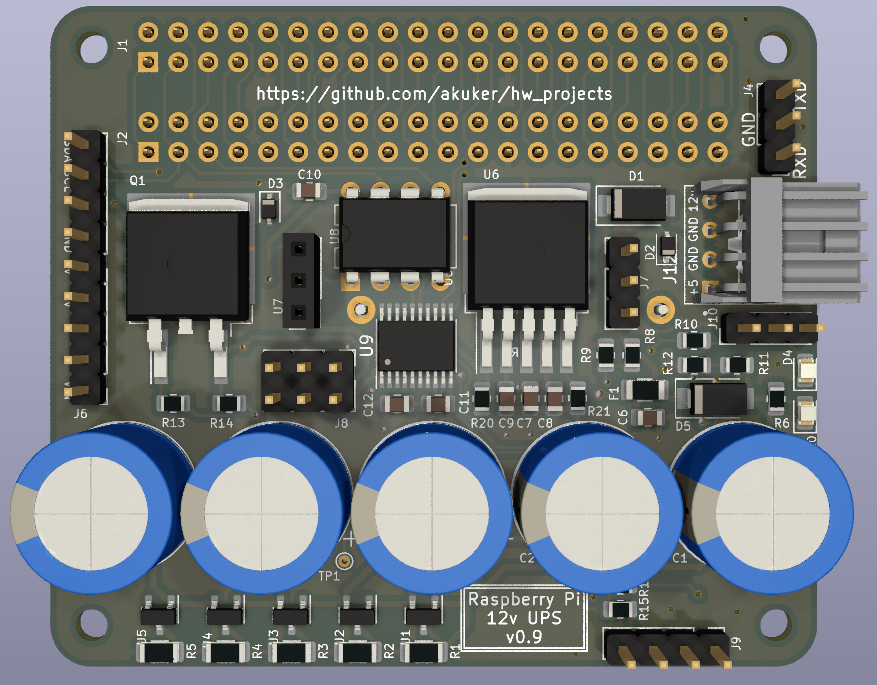
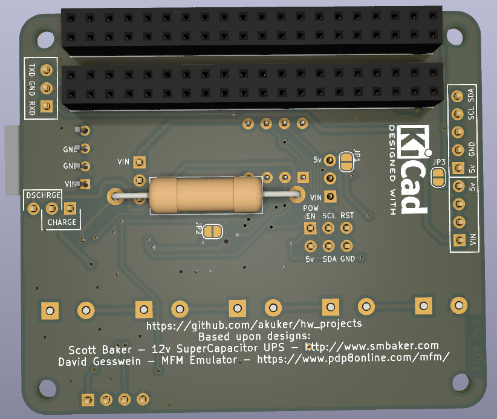
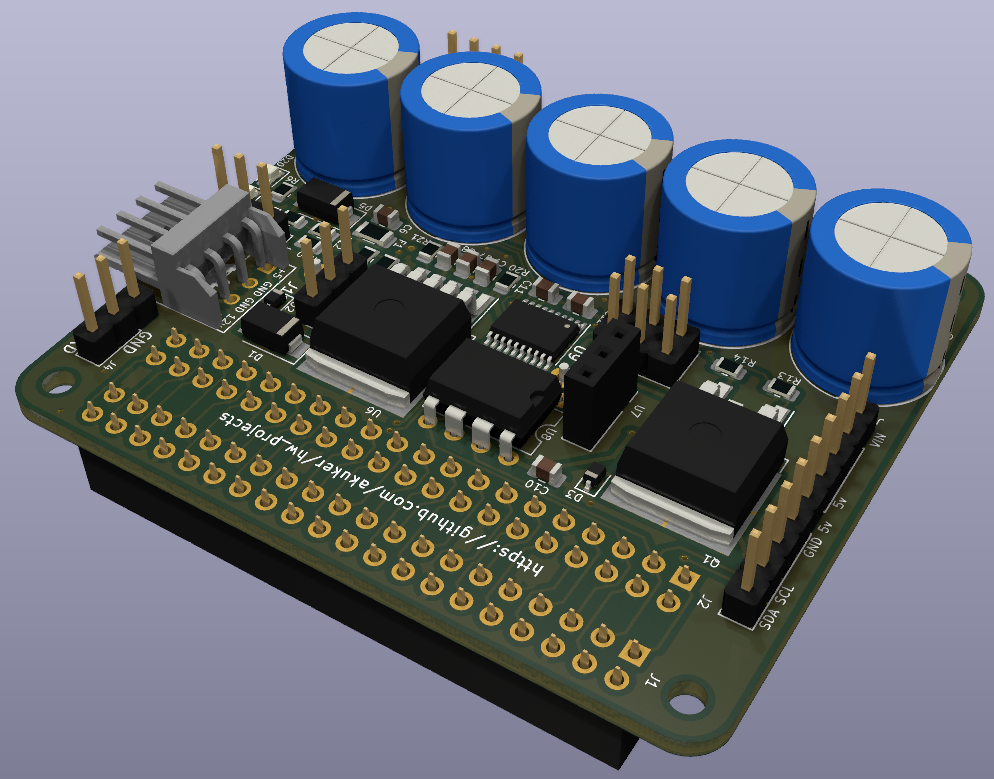

# Supercapacitor based UPS boards

This is a fork of the original Supercapacitor UPS board for a Raspberry Pi by Scott Baker, http://www.smbaker.com/

This fork is intended to improve producability, documentation and provide tighter integration with the RaSCSI project. This project does NOT require a RaSCSI to function.

## Why not other Supercapacitor designs?

Most of the existing Raspberry Pi UPS designs rely on GPIO pins to alert the Raspberry Pi of a power loss. The RaSCSI design makes heavy usage of the GPIO pins, so there are not sufficient spare to allow this. This design will utilize a microcontroller to manage the power and allow the Rapsberry Pi to read the status through I2C.

# Purpose

These boards are supercapacitor-based uninterruptable power supplies. The supercapacitor charges when power is applied, then when the power supply is terminated, the supercapacitor will operate the device long enough for it to shut down safely.

# Design - 12V board (5v output)

The 12V board uses five 2.7V supercapacitors in series, with 2.7V shunt regulators to ensure that no single capacitor is charged to more than 2.5 volts. A 3W resistor is used to limit the current that charges the capacitors. A jumper is provided to allow the capacitors to be rapid discharged. A mosfet is added to allow the load to be turned on/off.

Note: Scott Baker's original design also included a version of the UPS board that took a 5v input. This fork is focusing on the 12v version and will not include the 5v input version.

# Microcontroller manager

An ATTiny85 is used as the controller for the UPS. The microcontroller monitors the battery voltage and the incoming voltage, and switches the load on and off. The microcontroller supports I2C and can be interfaced directly to a raspberry pi.

The microcontroller is also responsible for noticing when power has been restored, and turning the load back on.

# Linux Daemon

A Linux daemon, running on the raspberry pi, monitors the voltage by making i2c queries to the ups board's microcontroller. If the daemon sees the incoming voltage drop, then it will initiate shutdown, by running the `shutdown` command. The shutdown command will terminate processes, unmount the filesystem, etc. 

As a final step during shutdown, Linux systemd will execute a script that will tell the microcontroller to turn off the load. At this point, the root filesystem has been remounted readonly, so the board can safely be powered off. 

# smb-pi-lib

Scott Baker has a second repository that has common code for a number of my projects, including the ups. It's located at [https://github.com/sbelectronics/smb-pi-lib](https://github.com/sbelectronics/smb-pi-lib)

# Acknowledgements

* Scott Baker for doing a fantastic supercapcitor based UPS design.
* David Gesswein's MFM Emulator was the inspiration for the supercapacitor charing circuit.
