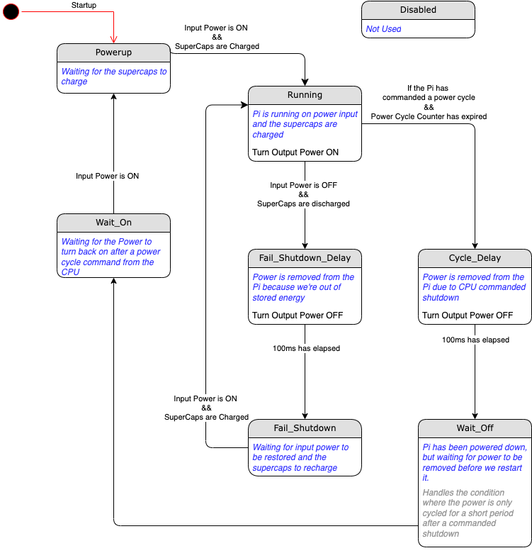

# I2C Register Definitions

| Offset | Description           |
| ------ | --------------------- |
| 0x00   | Reserved              |
| 0x01   | Reserved              |
| 0x02   | vin - low (reserved)  |
| 0x03   | vin - high            |
| 0x04   | vups - low (reserved) |
| 0x05   | vups - high           |
| 0x06   | mosfet switch state   |
| 0x07   | on threshold          |
| 0x08   | off threshold         |
| 0x09   | countdown in 100ms units |
| 0x0A   | cycle delay           |
| 0x0B   | fail-shutdown delay   |
| 0x0C   | run counter           |
| 0x0D   | powerup threshold     |
| 0x0E   | software shutdown threshold |
| 0x0F   | R1 resistor value     |
| 0x10   | R2 resistor value     |
  

